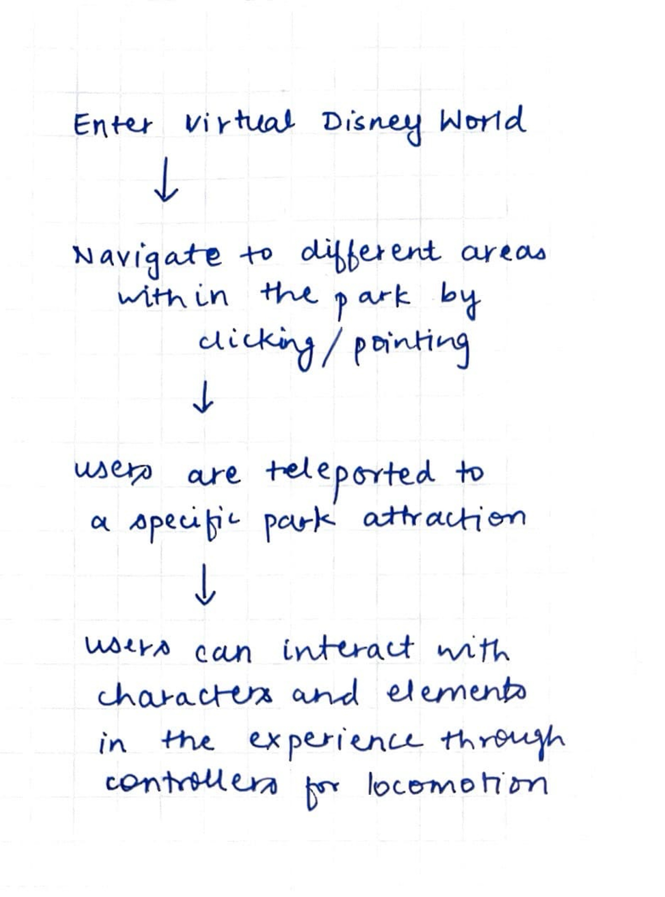
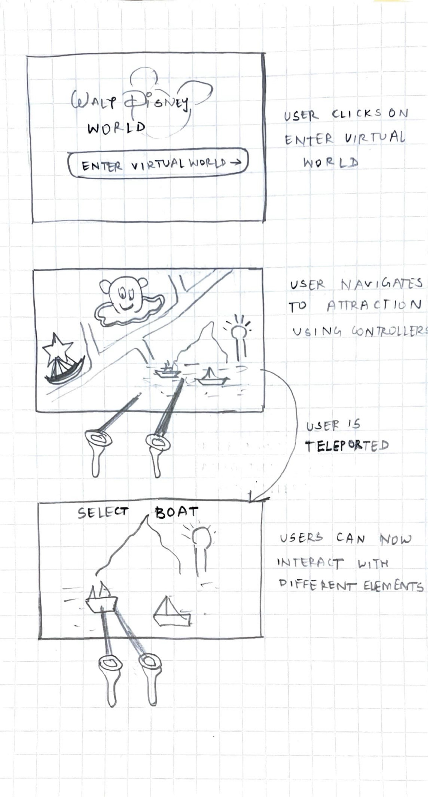
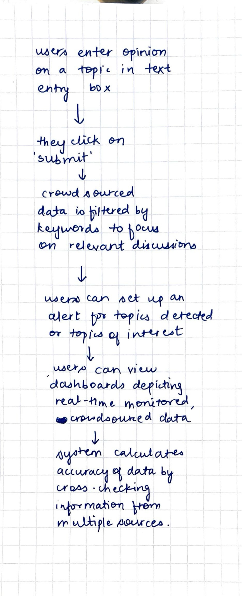
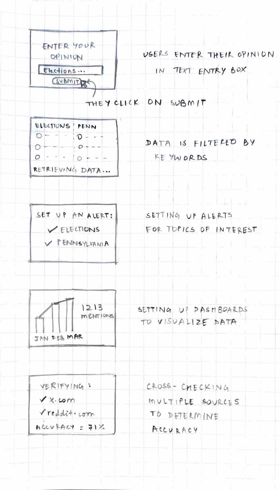
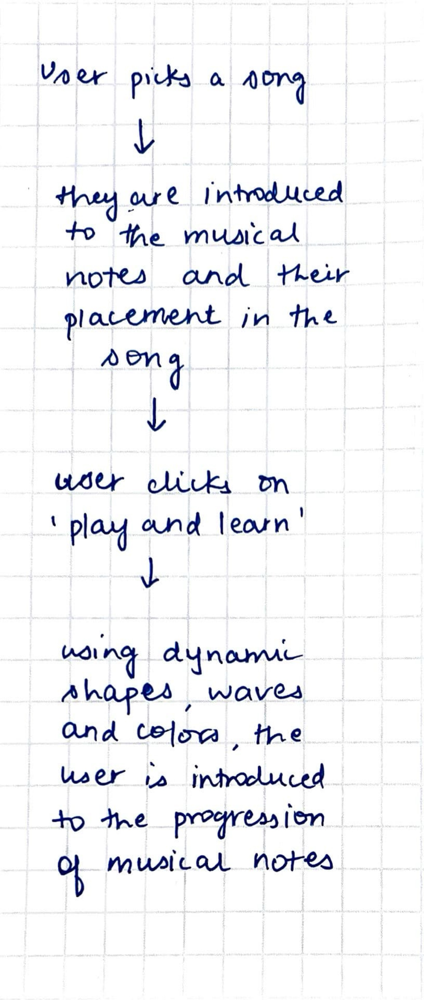
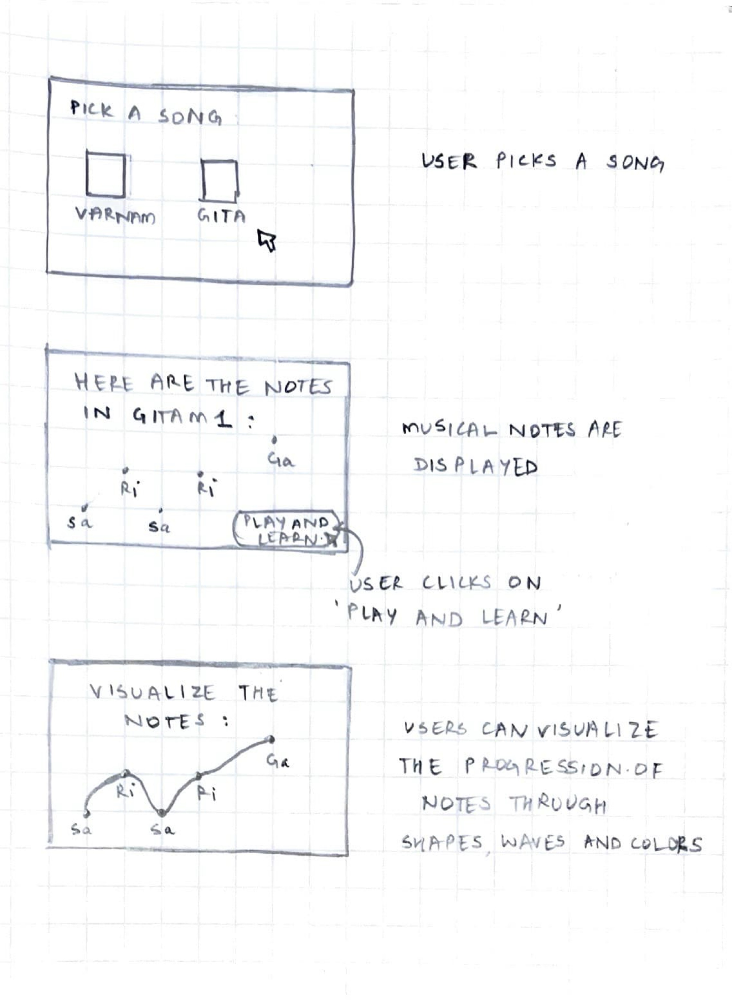

# FP4 - Final Project Writeup

# FP2 - Evaluation of the Final project

# FP1 - Proposal for Critique

## Table of Contents

1. [Design Sketches](#design-sketches)
   - [Disney World Virtual Experience](#disney-world-virtual-experience)
   - [CrowdAware](#crowdaware)
   - [Rāga](#rāga)
2. [Critique Summary](#critique-summary)
3. [Feedback Analysis](#feedback-analysis)

---

## Design Sketches

### Disney World Virtual Experience

  
  

**Design Description**: Experience Disney World right at the comfort of your homes by engaging in a wide range of park attractions alongside Disney characters.

- **Motivation**: While I browsed through the website for Disney World, Orlando, I noticed that the user experience was underwhelming. It did not enhance the sense of anticipation that a visitor experiences while planning a trip to Disneyland. Moreover, the park experience is limited to a small geography that prevents more users from experiencing the magic of Disney.
- **Interactivity and Engagement**: Using the WebXR API, the proposed website will enhance user engagement by enabling users to define their Disney Land experience. Users can teleport to different places in the park and interact with various elements and characters in real-time to chart out a plan for when they physically visit the Park.
- **Accessibility**: By enabling multiple input modes such as mouse, keyboard, and gesture controls, the user input will not be limited to only VR controllers. Wayfinding will be incorporated using signage to make users aware of their position relative to the environment.
- **Information to Include**: 3D map of the Park, attractions, Disney aharacters related to each zone, ride restrictions

---

### CrowdAware

  
  

**Design Description**: Unsensationalized and authentic crowdsourced news updates that are verified across multiple sources

- **Motivation**: Mainstream news coverage is often agenda-based and sides with one side of the story. By enabling users to undertake the role of journalists, crowdsourced news can reflect the true sentiment of users across different geographies and backgrounds. This will help uncover "hidden" details and make users more aware of their surroundings.
- **Interactivity and Engagement**: By leveraging Twitter API and Reddit API, public opinion and sentiment can be gauged. Data can be visualized using interactive dashboards that enable real-time news monitoring. News accuracy can be displayed for each contributed article by verifying across multiple sources.
- **Accessibility**: Using alt text for visualizations, using libraries such as Chart.js which offers inbuilt accessibility support for interactive charts, using semantic HTML and testing for screenreader compatibility.
- **Information to Include**: News source, relevant topics, related articles, trend charts, accuracy score

---

### Rāga

  
  

**Design Description**: Visualize the notes and melodies of Carnatic classical music through color, shape and movement

- **Motivation**: As a Carnatic vocalist, I have often found it difficult to memorize the positions of musical notes in a rendition while learning to sing it for the first time. This was until I learned the art of complimenting music with rhythm - moving my hands to the beat to register small intricacies that make classical music stand out. By combining audio and visual cues, learning classical music can be made easier.
- **Interactivity and Engagement**: Tone.js can be used to synthesize audio renditions and P5.js can be used to create movement on screen through colorful and dynamic visualizations that respond to the music played as we progress from one note to the next.
- **Accessibility**: Measures will include providing users with a choice of different color palettes that align with their nature of color sensitivity. Visualizations must also prevent hight photosensitivity that may trigger seizures in people with photosensitive epilepsy or other photo sensitivities. Screen reader compatibility must be ensured by using semantic HTML.
- **Information to Include**: Various Carnatic song choices, list of musical notes included, visualization of note progression data with timestamps

---

## Critique Summary

## Feedback Analysis
