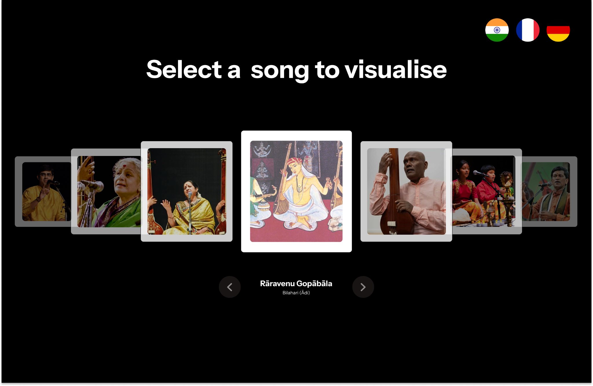
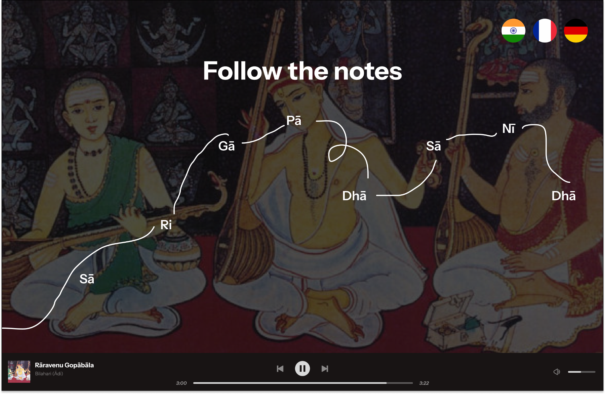
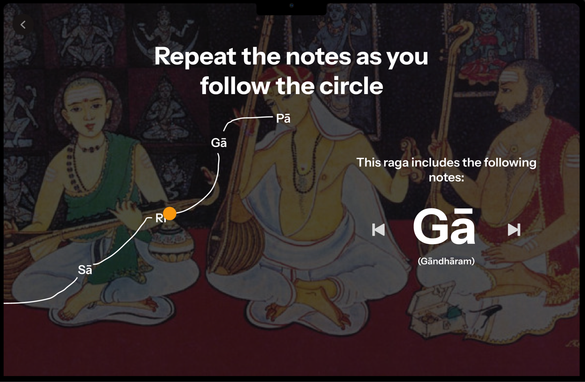
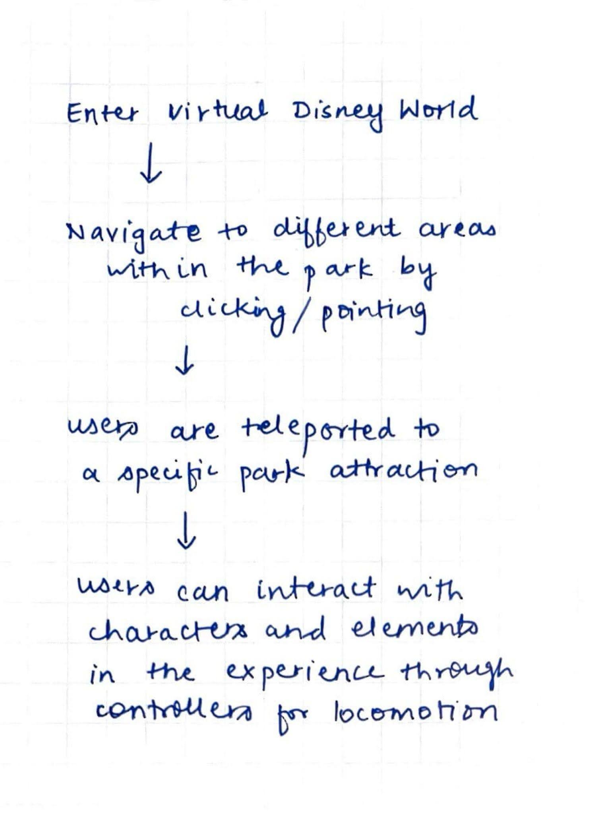
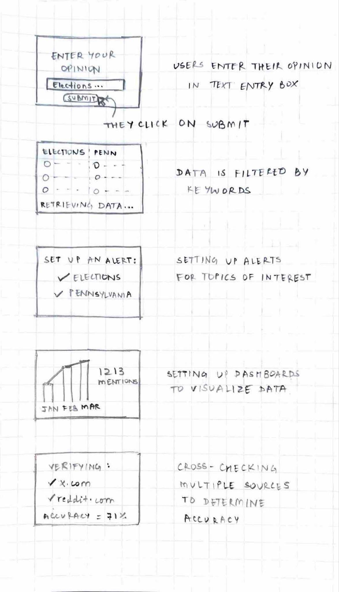

# **FP4 \- Final Project Writeup**

## Part 1: Website Description

As a Carnatic vocalist, I have often found it difficult to memorize the positions of musical notes in a rendition while learning to sing it for the first time. This was until I learned the art of complimenting music with rhythm - moving my hands to the beat to register small intricacies that make classical music stand out. By combining audio and visual cues, learning classical music can be made easier.
Through my website Rāga, singers can easily visualize the notes and melodies of Carnatic classical music through color, shape, and movement. The target audience for the website is comprised of novice singers and music enthusiasts who are particularly interested in learning Indian classical music. The website stores song data in the form of musical notes and path patterns that trace the transitions between the notes. It also stores audio sources for each song. This audio data in the form of frequency and amplitude is then used to render visualizations in real time. The website engages all types of users, including users with disabilities, by implementing supplemental media to learn music. This media includes visuals, audio, and text to invoke different senses. The website has been modularized to ensure high scalability, extending its use beyond the realm of Indian Classical music. Songs can be easily stored along with their corresponding notes and path progressions, and Rāgā will generate dynamic visualizations that respond to the audio. This flexibility positions Rāga as a tool for exploring a wide range of musical traditions while enhancing learning experiences for singers and music enthusiasts alike. By bridging the gap between sound and sight, Rāga offers a novel way to appreciate and learn the beauty of classical music.

## Part 2: User Interaction

1. **Select a rāgā to visualize**. Click on the side arrows on the Rāgā Catalog page to navigate to the rāgā of your choice; then click on the cover image to select it.
2. **Listen to each note**. Click on the Play control in the audio player at the bottom of the Path Visualizer page to listen to the sound of every note.
3. **Progress to various notes**. Click on the side arrows on the Path Visualizer page to navigate to the note of your choice.
4. **Play/pause the sound of each note**. Click on the Play/Pause control in the audio player at the bottom of the page to either play or pause the audio accompanying each note.
5. **Visualize the song**. Click on the cyan-colored button labeled “Visualize the Song” on the Path Visualizer page to proceed to the consequent webpage displaying dynamic song visualizations.
6. **Play/pause the visualizations**. Click on the cyan-colored button labeled “Play”/”Pause” at the bottom of the Frequency Visualizer page to toggle between playing and pausing the audio and visualization.

## Part 3: External Tool

1. **Swiper.js**
   - Swiper.js had readily implemented accessibility features such as ARIA labels. It also enabled me to incorporate keyboard control to move between different options in the carousel.
   - I used Swiper.js to create an album cover flow effect for the rāgā catalog on the landing page. Additionally, I used it to create a carousel effect while selecting the note audio and animation to play on the Path Visualizer page.
   - It provides me with an instance of the Swiper class that I can modify and customize. This helped me to create an album cover flow effect and carousel effect while ensuring accessibility.
2. **P5.js**
   - P5.js helped me explore creative coding in the realm of 2D visualizations. Through P5.sound, it also incorporates the audio data into its visualizations which gave me more flexibility by using a single library.
   - I used P5.js to record the frequency and amplitude values of different audio sources. I then mapped these data values to create a waveform with varying thicknesses.
   - This helped me add dynamism to the visuals on my website and make it responsive to the window’s width and height. It also ensures accessibility for users with disabilities through its the describe() and describeElement() functions.

## Part 4: Design Iteration

Similar to the FP2 design, I added navigation buttons to move between musical notes and pages to enhance the users’ sense of freedom and control. Emphasizing accessibility, I decided not to implement a drag-the-ball along-the-path interaction on the Path Visualizer page. I implemented a responsive carousel effect for selecting options on both the landing page (Rāgā Catalog) and the Path Visualizer page. In this iteration, I went beyond my initial scope and implemented a P5.js canvas for visualizing music for augmenting hearing-impaired users.

## Part 5: Implementation Challenge

- Initially, I started the project by hardcoding musical notations and path values in the HTML code. As the semester progressed, I learned more about Javascript, and this knowledge helped me write more modular and cleaner code that significantly enhanced reusability.
- While trying to implement sound functionality in P5.js, I struggled to find community resources for debugging. This prompted me to reference the documentation on the P5.js website to understand the workings of each predefined function, especially for ensuring accessibility.

## Part 6: Generative AI Use and Reflection

Describe how you used Generative AI tools to create this final project (fill in the following information, write \~500 words in total).

Document your use of all GenAI tools — ChatGPT, Copilot, Claude, Cursor, etc. using the template below. Add/Delete rows or bullet points if needed, and replace Tool1/Tool2 with the name of the tool.

### Usage Experiences by Project Aspects

Feel free to edit the column \_ (other?) or add more columns if there's any other aspect in your project you've used the GenAI tools for.

For the following aspects of your project, edit the corresponding table cell to answer:

- _Usage_: Whether you used / did not use this tool for the aspect. Enter [Yes/No]
- _Productivity_: Give a rating on whether this tool makes your productivity for X aspect [1-Much Reduced, 2-Reduced, 3-Slightly Reduced, 4-Not Reduced nor Improved, 5-Slightly Improved, 6-Improved, 7-Much Improved].

| Tool Name | Ratings      | design | plan | write code | debug |
| :-------- | :----------- | :----- | :--- | :--------- | :---- |
| Gemini    | Usage        | No     | No   | Yes        | Yes   |
| Gemini    | Productivity | 4      | 4    | 5          | 7     |

### Usage Reflection

> Impact on your design and plan

- It matched my expectations and plan in [FP2](#generative-ai-use-plan) in that Gemini helped me quickly sift through a number of Javascript libraries and frameworks to suggest the most appropriate one for the context of my project.

-It matched my expectations and plan in [FP2](#generative-ai-use-plan) in that I did not use Gemini to create curves and path progressions between various musical notes since it did not allow me to customize them and ignored minute nuances.

- It matched my expectations and plan in [FP2](#generative-ai-use-plan) in that I did not use Gemini to generate standalone ideas to implement within the project.

- It did not match my expectations and plan in [FP2](#generative-ai-use-plan) in that Gemini helped me write code to navigate the integration of P5.js while dynamically updating DOM elements with the help of event listeners. It also helped me with suggested values for CSS properties to make the website responsive for smaller screen sizes.

- Gemini did not influence my final design and implementation plan because it does not provide customization or desired flexibility in terms of setting up a schedule that is open to unexpected changes. Specifically, I found myself improvising my proposed plan for the PUI project depending on challenges encountered on the learning curve for using a specific framework/library. Another drawback was limited access to the Premium version of Gemini. Only after purchasing the Premium plan close to the end of the Fall semester was I able to get close to the desired results from Gemini after it referenced the history of prompts.

> Use patterns

- I accepted the generations when Gemini suggested libraries and frameworks followed by a justification of proposed use cases in the context of my project.
- I critiqued/evaluated the generated suggestions when Gemini tried to remove all forms of hardcoded values during debugging. This was particularly hard to evaluate when I had hardcoded SVG values for individual path progressions for each rāgā/song.
- Additionally, I critiqued Gemini's functionality when it required me to reupload project files to debug the code after I manually made changes to it.

> Pros and cons of using GenAI tools

- Pros
  1. Gemini helps identify repeated patterns in code across files.
  2. Gemini helps inculcate good coding habits for easier maintainability.
- Cons
  1. Gemini can oversimplify and overgeneralize customized code like creative art forms in libraries like P5.js.
  2. Gemini reinforces automation bias that prevents programmers from reevaluating the model’s generated output relative to our context because we assume that the machine has produced the correct result.

### Usage Log

[Gemini](https://g.co/gemini/share/ab91ff98abc3)

---

# **FP3 \- Final Project Check-in**

Document the changes and progress of your project. How have you followed or changed your implementation & GenAI use plan and why? Remember to commit your code to save your progress.

## Implementation Plan Updates

- [x] Week 9 Oct 28 \- Nov 1:
  - [x] FP1 due
  - [x] Create static pages on Figma for the lab session
  - [x] Interpret notes from critique in the lab session
  - [x] Create dynamic high-fi prototypes on Figma
  - [x] Create usability test plan
- [ ] Week 10 Nov 4 \- Nov 8:
  - [x] Run usability tests on two users
  - [x] Debrief and interpret notes from usability tests
  - [x] Update design on Figma
  - [x] FP2 due
  - [x] Defining HTML/CSS for landing page
  - [x] Integrating song catalog using APIs
  - [x] Creating interactive music play feature
- [ ] Week 11 Nov 11 \- Nov 15:
  - [ ] FP3 presentation
  - [ ] Interpret notes from critique in the lab session
  - [ ] **Checkpoint** - test for accessibility of webpages
  - [ ] Implement changes based on user feedback
  - [ ] Designing template for visualization of notes using P5.js
  - [ ]Determining color palettes
- [ ] Week 12 Nov 18 \- Nov 22:
  - [ ] Implement interactivity using haptic feedback
  - [ ] Check for responsiveness on multiple screen sizes
  - [ ] **Checkpoint** - test for accessibility of webpages
  - [ ] Implement changes based on user feedback
  - [ ] Experiment with color palettes to communicate mood/genre
- [ ] Week 13 Nov 25 \- Nov 29:
  - [ ] Run usability tests with target users
  - [ ] Debrief and interpret notes from usability tests
  - [ ] **BREAK** - Thanksgiving
- [ ] Week 14 Dec 2 \- Dec 6:
  - [ ] Implement changes based on user feedback
  - [ ] FP4 due

## Generative AI Use Plan Updates

### _Tool Use_

- Gemini
  - I will use it for suggestions on APIs to use because it can help me align the search for APIs with the context of my project
  - I will not use it for defining waveforms for tactile interactivity because it might not be able to help me with accurately defining hand movements based on the progression of musical notes

### _Responsible Use_

Although I will cite the use of Generative AI in all instances within my project, I will not use it to generate standalone ideas to implement within the project. Additionally, I will critically review the results generated by it and further prompt or probe it to ensure that algorithmic bias does not creep into its suggestions.

Remember to keep track of your prompts and usage for [FP4 writeup](#part-6-generative-ai-use-and-reflection).

---

# **FP2 \- Evaluation of the Final project**

## Project Description

As a Carnatic vocalist, I have often found it difficult to memorize the positions of musical notes in a rendition while learning to sing it for the first time. This was until I learned the art of complimenting music with rhythm - moving my hands to the beat to register small intricacies that make classical music stand out. By combining audio and visual cues, learning classical music can be made easier.
Through Rāga, singers can easily visualize the notes and melodies of Carnatic classical music through color, shape and movement.

## High-Fi Prototypes

[Link to Figma prototypes](https://www.figma.com/proto/P1LRM2TZJ3l0EcP0fbxnzD/R%C4%81ga?page-id=0%3A1&node-id=1-2&node-type=canvas&viewport=377%2C290%2C0.12&t=d5261rd54I0MPl9m-1&scaling=scale-down&content-scaling=fixed&starting-point-node-id=1%3A2&hotspot-hints=0)

[Link to demo video clip](https://drive.google.com/file/d/185hIDpxbwPyMlNPqxgtph_Ygsj17f5yx/view?usp=sharing)

### _Prototype 1_

This prototype clearly communicated its purpose to the users. It drew their attention to its variety of cover images, with users noting the visible hierarchy of information through different font sizes. Users intuitively clicked on the cover image card to navigate to the song.

### _Prototype 2_

The second prototype caused visible confusion among users. They were unsure of how to interact with the elements on the screen. One notable piece of feedback from a user emphasized the need for more information about musical notes for novice users.

## Usability Test

- **Target Users**: Singers, musicians
- **Goals**:

  1. Understand which information is critical to aid target users’ learning process
  2. Determine if the labelling of the interface intuitive for new users

- **Method**: Think-Aloud Protocol
- **Tasks/Questions**:

  1. What do you think the purpose of this tool is?
  2. As you browse through the song catalog, what do you observe?
  3. What do you suppose the next step is for utilizing the tool?
  4. How might you interact with the visualization page?
  5. If you wanted to go back to viewing the song catalog, how would you accomplish this?

- **Summary**: The first prototype encouraged users to explore the music catalog, successfully achieving its purpose through intuitive buttons and card interactions. The second prototype, however, played the role of a static screen after the first interaction, confusing the users about the next possible steps and their interpretation of the information presented. This inspired me to redesign the second prototype to enable higher interactivity and clarity in the information presented.

## Updated Designs

To enhance interactivity, I prompted users to drag the ball on-screen along the predetermined path with musical notes as milestones. This encourages kinesthetic learning and actively engages the users. For beginners, I included introductory information about the musical notation used. Additionally, to enhance the users’ sense of freedom and control, I added navigation buttons to move between musical notes and pages.

## Feedback Summary

A common piece of feedback I received during the lab session included scoping down by selecting one prototype and adding more interactivity to that. Secondly, a peer suggested adding features to allow users to navigate between pages seamlessly. Additionally, emphasizing the benefits of practicing singing through this method can help reinforce the idea of it.

## Milestones

### _Implementation Plan_

- [x] Week 9 Oct 28 \- Nov 1:
  - [x] FP1 due
  - [x] Create static pages on Figma for the lab session
  - [x] Interpret notes from critique in the lab session
  - [x] Create dynamic high-fi prototypes on Figma
  - [x] Create usability test plan
- [ ] Week 10 Nov 4 \- Nov 8:
  - [x] Run usability tests on two users
  - [x] Debrief and interpret notes from usability tests
  - [x] Update design on Figma
  - [x] FP2 due
  - [ ] Defining HTML/CSS for landing page
  - [ ] Integrating song catalog using APIs
  - [ ] Creating interactive music play feature
- [ ] Week 11 Nov 11 \- Nov 15:
  - [ ] FP3 presentation
  - [ ] Interpret notes from critique in the lab session
  - [ ] **Checkpoint** - test for accessibility of webpages
  - [ ] Implement changes based on user feedback
  - [ ] Designing template for visualization of notes using P5.js
  - [ ]Determining color palettes
- [ ] Week 12 Nov 18 \- Nov 22:
  - [ ] Implement interactivity using haptic feedback
  - [ ] Check for responsiveness on multiple screen sizes
  - [ ] **Checkpoint** - test for accessibility of webpages
  - [ ] Implement changes based on user feedback
  - [ ] Experiment with color palettes to communicate mood/genre
- [ ] Week 13 Nov 25 \- Nov 29:
  - [ ] Run usability tests with target users
  - [ ] Debrief and interpret notes from usability tests
  - [ ] **BREAK** - Thanksgiving
- [ ] Week 14 Dec 2 \- Dec 6:
  - [ ] Implement changes based on user feedback
  - [ ] FP4 due

### _Libraries and Other Components_

- **Tone.js** for synthesizing audio renditions
- **P5.js** to create movement on-screen through colorful and dynamic visualizations
- **Web Speech API** for text-to-speech support for users with low vision
- **D3.js** to add large, descriptive labels for elements on-screen for users with low vision
- **Chroma.js** to determine accessible color palettes for colorblind users

## Generative AI Use Plan

### _Tool Use_

- ChatGPT
  - I will use it for suggestions on APIs to use because it can help me align the search for APIs with the context of my project
  - I will not use it for defining waveforms for tactile interactivity because it might not be able to help me with accurately defining hand movements based on the progression of musical notes
- GitHub Copilot
  - I will use it to create test cases for unit testing and integration testing because it can help power my code by accounting for edge cases
  - I will not use it for coding components because it might limit my ability as a programmer and designer
- Perplexity.ai
  - I will use it as a secondary research assistant because it can help me quickly sift through broad insights from multiple white papers to inform my design
  - I will not use it for determining Indian classical musical notations because it might produce inauthentic results

### _Responsible Use_

Although I will cite the use of Generative AI in all instances within my project, I will not use it to generate standalone ideas to implement within the project nor will I use it to generate code. Additionally, I will critically review the results generated by it and further prompt or probe it to ensure that algorithmic bias does not creep into its suggestions.

---

# **FP1 \- Proposal for Critique**

## Idea Sketches

### _Disney World Virtual Experience_

**Design Description**: Experience Disney World right at the comfort of your homes by engaging in a wide range of park attractions alongside Disney characters.

- **Motivation**: While I browsed through the website for Disney World, Orlando, I noticed that the user experience was underwhelming. It did not enhance the sense of anticipation that a visitor experiences while planning a trip to Disneyland. Moreover, the park experience is limited to a small geography that prevents more users from experiencing the magic of Disney.
- **Interactivity and Engagement**: Using the WebXR API, the proposed website will enhance user engagement by enabling users to define their Disney Land experience. Users can teleport to different places in the park and interact with various elements and characters in real-time to chart out a plan for when they physically visit the Park.
- **Accessibility**: By enabling multiple input modes such as mouse, keyboard, and gesture controls, the user input will not be limited to only VR controllers. Wayfinding will be incorporated using signage to make users aware of their position relative to the environment.
- **Information to Include**: 3D map of the Park, attractions, Disney aharacters related to each zone, ride restrictions

### _CrowdAware_

**Design Description**: Un-sensationalized and authentic crowdsourced news updates that are verified across multiple sources

- **Motivation**: Mainstream news coverage is often agenda-based and sides with one side of the story. By enabling users to undertake the role of journalists, crowdsourced news can reflect the true sentiment of users across different geographies and backgrounds. This will help uncover "hidden" details and make users more aware of their surroundings.
- **Interactivity and Engagement**: By leveraging Twitter API and Reddit API, public opinion and sentiment can be gauged. Data can be visualized using interactive dashboards that enable real-time news monitoring. News accuracy can be displayed for each contributed article by verifying across multiple sources.
- **Accessibility**: Using alt text for visualizations, using libraries such as Chart.js which offers inbuilt accessibility support for interactive charts, using semantic HTML and testing for screen reader compatibility.
- **Information to Include**: News source, relevant topics, related articles, trend charts, accuracy score

### _Rāga_

**Design Description**: Visualize the notes and melodies of Carnatic classical music through color, shape and movement

- **Motivation**: As a Carnatic vocalist, I have often found it difficult to memorize the positions of musical notes in a rendition while learning to sing it for the first time. This was until I learned the art of complimenting music with rhythm - moving my hands to the beat to register small intricacies that make classical music stand out. By combining audio and visual cues, learning classical music can be made easier.
- **Interactivity and Engagement**: Tone.js can be used to synthesize audio renditions and P5.js can be used to create movement on screen through colorful and dynamic visualizations that respond to the music played as we progress from one note to the next.
- **Accessibility**: Measures will include providing users with a choice of different color palettes that align with their nature of color sensitivity. Visualizations must also prevent high photosensitivity that may trigger seizures in people with photosensitive epilepsy or other photo sensitivities. Screen reader compatibility must be ensured by using semantic HTML.
- **Information to Include**: Various Carnatic song choices, list of musical notes included, visualization of note progression data with timestamps

## Feedback Summary

### Disney World Virtual Experience

- Defining the scope of the experience was a major concern
- Maintaining accessibility standards in a VR environment has to be looked into
- Ensuring uniformity in the sourcing of 3D assets

### CrowdAware

- Defining sources of news updates needs to be looked into
- Maintaining consistency between visualizations for different types of news
- Controlling noise in data sourced
- Negating bias introduced through reliance on public opinion

### Rāga

- Defining the type of music to focus on to reduce complexity
- Simplifying song sourcing by finding an existing API (if any)
- Taping into common characteristics of songs like mood, genre, etc. of a particular song

## Feedback Digestion

After reviewing the feedback provided, I realized that testing with VR for Disney World Virtual Experience can be time-consuming in the current project timeline. Additionally, Disney 3D assets may be protected by copyright laws, which poses a significant hurdle to the project's progress.
In the case of **CrowdAware**, the nature of crowdsourced data can introduce inconsistencies and biases in visualizing trends in news updates.

This brings me to my third idea: **Rāga**. I came up with the following action points to consider in my next design:

- Focusing on a fixed set of songs to visualize and test easily
- Adding additional attributes like mood and genre to the music data to determine a way to ensure consistency in visualizations
